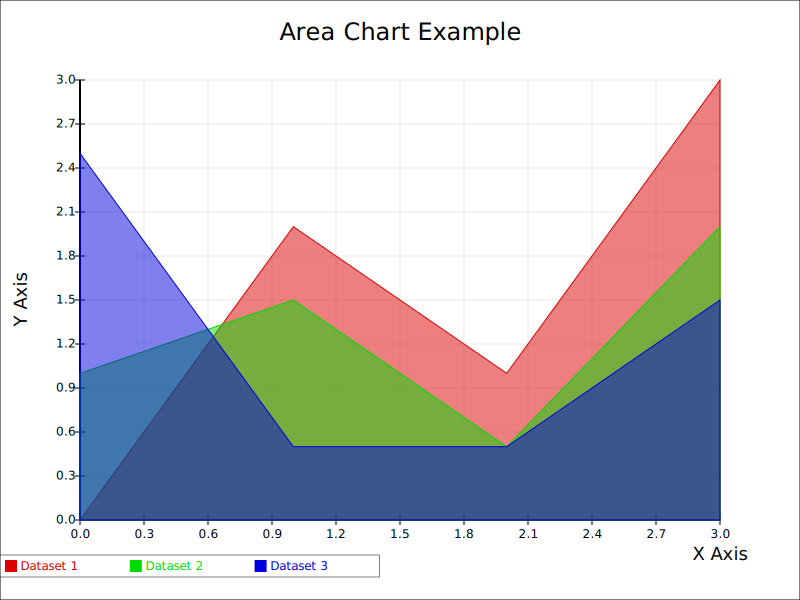

# SVG Area Chart Display

This project demonstrates a SVG area chart display using Rust.

## Features

- Area chart visualization
- Customizable colors, fonts, sizes, etc.

## Screenshots



## Installation

1. Clone the repository:
    ```sh
    git clone https://github.com/dataviz-rs/dataviz-examples.git
    ```
2. Navigate to the project directory:
    ```sh
    cd dataviz-examples/<example-project>
    ```
3. Build the project:
    ```sh
    cargo build
    ```

## Usage

Run the application:
```sh
cargo run
```

## Contributing

Contributions are welcome! Please open an issue or submit a pull request.

## License

This project is licensed under the MIT License.